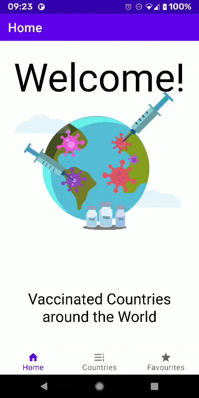
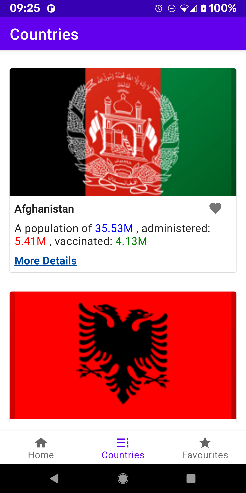
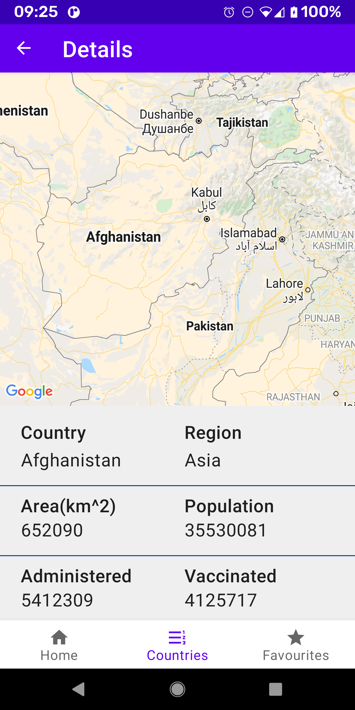

#  Covid Vaccine around the World App #

An app that helps a user view COVID vaccination data for any country using this API:  https://github.com/M-Media-Group/Covid-19-API#vaccines-data

The App is intended for users to quickly fetch up to date information on the COVID-19 epidemic.

The app should have three screens, as follows:

Screen 1 Home Screen, showing a welcoming Title, then animation then a short Description of the App.

Screen 2 is A list of countries with a summary of details. A user can add or remove any country to and from favourites. Users can also click on the More Details hyperlink, to navigate to a detailed screen where the country isd displayed inside GoogleMaps, as well as, some of the data, preented.

Screen 3 is A list of favourites with a summary of details. A user can remove any country from favourites. A popup is displayed, when this is done, and from the favourites screen, a gentle reminder to refresh ( pulldown ) the latest. Users can also click on the More Details hyperlink, to navigate to a detailed screen where the country isd displayed inside GoogleMaps, as well as, some of the data, preented.

##  Screenshots: ##

 
##  A simple Android app that demonstrates clean code architecture. ##

You get all the data you want from the following API endpoints:

GET https://github.com/M-Media-Group/Covid-19-API#vaccines-data

## Layers: ##
### Data
### Domain
### Presentation

## Data Layer

Network Layer : consists of the retrofit api service interface, mappers to convert network Dtos to domain model, and the Dto network model file.
Di : consists of : URL module, to allow hilt's DI dependency to swap modules, for easily testing, replacing the url, with localhost, for Mock servers, like MockWebServer. NetworkModule, RepositoryModule and RoomModule. 
Room Layer: Consists of 3 layers: DB layer which contains the Dao and Database files, Mappers, conversion between Domain model and Room Entity models, and the model layer with the Entity file. 
Repository : consists of the interface Repository, and its implementation MainRepository. 

## Domain Layer ##

Domain Model. 

I've added an interface to the Repository. Motivation behind this, is , once a project grows in complexity, it is better to start using USECASES. Add the use-cases to the domain layer, as well as, the interfaces that will define the interaction between the use-cases and repository functionality. Use-cases facilitate better readability of the code, since they are self-descriptive.

## Presentation Layer

app : consists of CovidVaccinationApplication, which initialises the Hilt Dagger dependency graph.
datastate : dealing with loading state, etc
ui : consists of the ui files, activities, recycler adapter, decorator. etc.
utils : extension files, color extension file used to quickly add html style formatting to textviews easily.
viewmodel : the main activity viewmodel

## Testing

## Unit Tests: ##

### Data Layer

### Network:

NetworkMapperTest 100% coverage, to ensure all mappings are correct between the Network and Domain layers.

### VaccinatedRepositoryTest Tests:

when remote api returns success Then repo should also return success with correct mapping

Room CacheMapperTest 100% coverage, to ensure all mappings are correct between the Room and Domain layers.

## Presentation ##

### CountryListViewModel tests:
Given collections are loaded When data source is success Then emit success view state
Given collections are loaded When data source is error Then emit error view state

### FavouriteListViewModel tests:
Given favourites are loaded When data source is success Then emit success view state
Given favourites are loaded When data source is error Then emit error view state

## Instrumentation Tests ##

### ROOM Tests
### CountryDatabaseTest test:
Inserts 
Updates - Test the Favourites are updated correctly

### MainActivity

### Home SCreen
Test #1 : testing main screen comes into view 
Test #2 : testing welcome title comes into view 
Test #3 : testing description comes into view 
Test #4 : testing bottom navigation bar, the home icon is checked 
Test #5 : testing bottom navigation bar, the countries list icon is unchecked 
Test #6 : testing bottom navigation bar, the favourites list icon is unchecked 
Test #7 : testing bottom navigation bar, when the countries icon is clicked,  the countries list screen comes into view 
Test #8 : testing bottom navigation bar, when the favourites icon is clicked,  the favourites list screen comes into view 

### Countries List Screen 
Test #1 : testing recyclerview comes into view 
Test #2 : testing the functionality of the favourites icon is clicked, it should change icon to indicate that it is added to favourites 
Test #3 : testing the functionality of the favourites icon is unclicked, it should change icon to indicate that it is removed from favourites 
Test #4 : testing the functionality of the detailed screen, when the More Details hyperlink is clicked, the detailed screen comes into view 

### Favourites List Screen 
Test #1 : testing recyclerview comes into view 
Test #2 : testing the functionality of the favourites icon is clicked, it should change icon to indicate that it is added to favourites 
Test #3 : testing the functionality of the favourites icon is unclicked, it should change icon to indicate that it is removed from favourites 
Test #4 : testing the functionality of the detailed screen, when the More Details hyperlink is clicked, the detailed screen comes into view 

### Detailed Screen 
Test #1 : testing Detailed Screen comes into view 
Test #2 : testing the Country is displayed correctly, both the title as well as the value 
Test #3 : testing the Region is displayed correctly, both the title as well as the value 
Test #4 : testing the Area is displayed correctly, both the title as well as the value 
Test #5 : testing the population is displayed correctly, both the title as well as the value 
Test #6 : testing the administered is displayed correctly, both the title as well as the value 
Test #7 : testing the people Vaccinated is displayed correctly, both the title as well as the value 

## TODO
1. tests 2-7, for the instrumentation Detailed Screen Tests, require a Mocking Server
2. As mentioned, I've introduced Repository interfaces for several reasons. One, is in the future, clear goal of moving the Repository interface into the Domain(Business) layer. and then introduce Use-CASES that will interface through these interfaces.
3. Add Events that will represent View States, inside the Presentation layer. These will be sealed classes.
4. Clean up the API retrieval , as well as , obtaining data for the Country Codes. Possibly, using the built in support of ROOM to allow preloaded data.
5. I could have used Jetpack's compose and use the build in support between composable updates and compose states within the ViewModels.
6. If given time, I would write a thorough test report , showing the coverage , and hightlighting testing strategies.
7. Introduce some amazing plugins and libraries, use lint, to show report, as well as, klint , to show automated uniformed formatting, and a plugin to add function header comments, using AI.
8. used lint, to give me a report, to check I haven't got unused Gradle dependencies ( which I have and I would/will remove them,), unused imports and resources, as well as, ensure no strings are hardcoded as well as, spend a little time on a Theming strategy , and again remove hard-coded dimensions, colors and other resources.
So please don't mark me down for these, I didn't want to quickly do things , and end up breaking things. again there is a fine balance.

## Summary
1. I've used clean code architecture
2. I've separated the business model, Country, from the Network Model( CountryDto) and the cache model ( CountryEntity). DTOs and Entitys are independent of each other, through mappers that map between and from the business model to entity and Dtos. Interface has been used to allow conformity between the two.
3. BaseDao is used, to show the limited inheritence support of ROOM, to allow generic functionality of CRUD ( except one or two ) of all DAOs
4. Complex Helper classes have been written to allow instrumentation tests of clicking on icons etc.
5. I have used Navigational Components to show the latest support of how to use it, to link the menu , navigational graph and the fragments to automate navigate between them without writing additional code.
6. I have added both Unit and Instrumentation tests. If given time, I would write a thorough report , showing the coverage , and hightlighting testing strategies.

8. 
9. 
